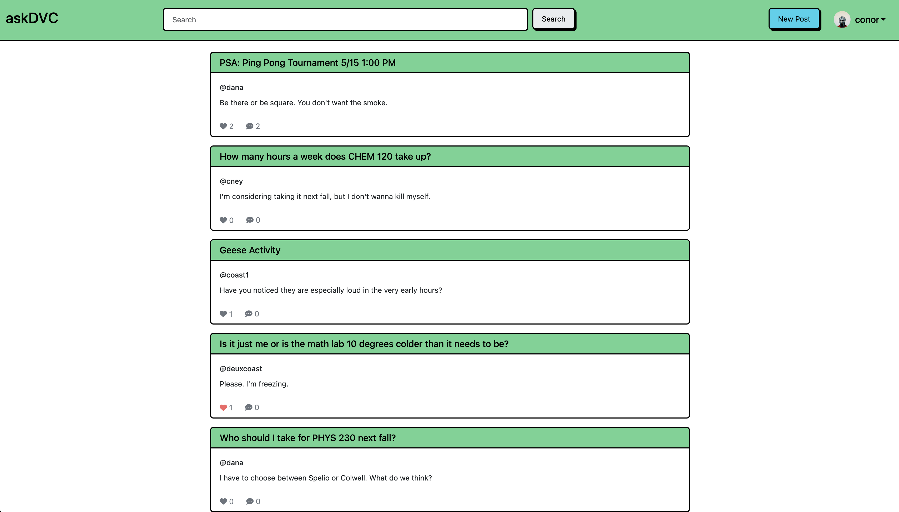
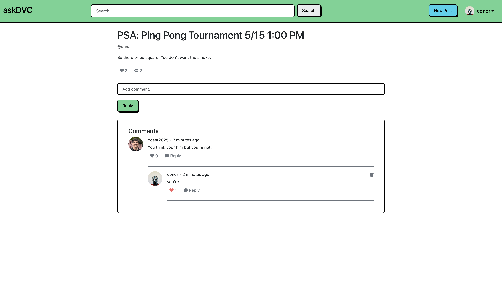

# askDVC

# Table of Contents

1. [Overview](#overview)
2. [Project Background](#background)
3. [Contributor Guide](#contributors)

# Overview 

**askDVC** is a website for students to ask questions, provide answers and, make
life a little easier for each other. The idea is to have a central place where
students can come to ask questions about their classes, teachers, and life as a
student at large.

Whether it's questions about which professor to take, how manageable 20
credits in a semester is, where the best place on campus to study is, or
advice on making friends - askDVC aims to create a place where knowledge is
pooled, and student's can share their experiences.

---

# Project Background 

 </img>

askDVC was built over 4 weeks in the Spring of 2025 as part of
[Project Bracket](https://projectbracket.webflow.io/) at Diablo Valley College.

## Tech Stack

- [Django](https://www.djangoproject.com/): The project is written in Python
  using the Django web framework.

- [Bootstrap](https://getbootstrap.com): The UI is built with the Bootstrap
  toolkit, with theming provided by [Bootswatch](https://bootswatch.com/).

## Team Members

#### Aanya

Github: [@FlyHighStem](https://github.com/FlyHighStem)

#### Conor Ney

Github: [@deuxcoast](https://github.com/deuxcoast)

#### Jordan

Github: [@jayracher](https://github.com/jayracher)

#### Karen Zhao

Github: [@karen2zhao](https://github.com/karen2zhao)

#### Matthew

Github: [@mattag1234](https://github.com/mattag1234)

---

# Contributor Guide 

## Instructions for setting up the project

**All of these commands should be run from a terminal in the base directory of
the project**. After cloning the project, we should `cd` into the repository.

> [!WARNING]
> These commands are for zsh/bsh shells, which should work for most MacOS and
> Linux users. For Windows users the commands below may be different.

1. Clone the project. To do this, `cd` into the directory you want the project
   to be stored in, then run the following command:

   `git clone https://github.com/deuxcoast/ask-dvc.git`

2. `cd` into the directory we just downloaded, this is where all of the
   project files are.

   `cd ask-dvc`

3. Create a virtual environment.

   `python3 -m venv .venv`

4. Activate the virtual environment

   `source .venv/bin/activate`

5. Download the dependencies required to run the project, as listed in the
   `requirements.txt` file.

   `pip install -r requirements.txt`

6. Run the migrations necessary to bring the database up to the correct
   state.

   `python manage.py migrate`

7. Spin up the development server and get going!

   `python manage.py runserver`
